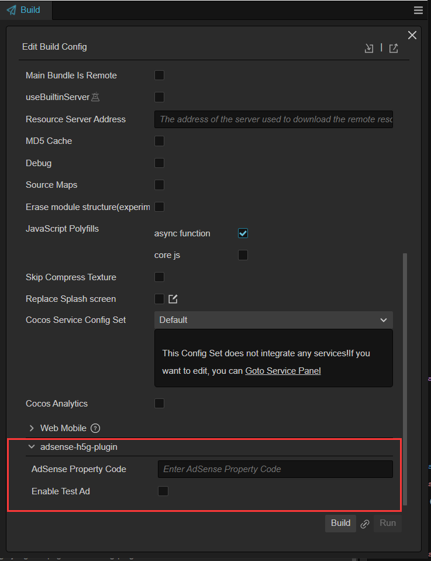

# AdSense H5 游戏广告插件

## 简介

Google Adsense 是一个由 Google 公司设置的广告计划，会员可以利用 Youtube 流量和 Blogspot 功能置入广告服务，以赚取佣金。本插件可以帮助您快速整合 AdSense H5 游戏广告到您的 H5 游戏里，目前支持 web-mobile 和 web-desktop 这两个平台。

## 使用方式

先参考 [Cocos Creator 官网的相关文档](https://docs.cocos.com/creator/manual/zh/editor/extension/install.html) 在扩展管理器内添加本插件后并启动插件，即可在构建面板上看到关于 AdSense 游戏广告的相关配置，填写对应得广告代码配置后即可集成此功能。



<!-- 您可以查阅 [Adsense 属性代码的获取可以参考论坛的相关文档](https://support.google.com/adsense/answer/9274019) 来获取属性代码，  -->

更多关于 Google AdSense 的内容请查阅 [官网上的相关介绍](https://www.google.com/adsense/new/u/0/pub-4552344828371429/onboarding)。
开发者文档 [开发者文档](https://developers.google.com/ad-placement?hl=zh-cn)

准备：
1. 注册 Google AdSense 账号、能够公开访问的的网站域名
2. 申请网站批准后，创建广告
2. 编辑器启用了 AdSense 插件

编辑器操作：
1. 导入 adsense-h5g-plugin 插件
2. 构建 web-mobile、web-desktop
  a. AdSense 插件构建配置，勾选 ‘开启 AdSense H5 游戏广告插件’
  b. 输入 AdSense 属性代码，从 Google AdSense 账号中获取
  c. 使用测试广告：模拟测试广告，预览广告在视频中的插入位置和效果，不会影响实际的广告展示和收入
  d. AFP 主机属性代码：我搜

 构建成功后，html 中会插入下面代码
  ```
 <script async
    data-ad-client="ca-pub-xxxxxxxxxx"
	data-adbreak-test="on"
    data-ad-host="ca-host-pub-xxxxxxxxx"
    src="https://pagead2.googlesyndication.com/pagead/js/adsbygoogle.js">
  </script>
  ```
3. 在游戏中调用 adBreak API，只有调用 adBreak() 才会展示广告，具体参考**开发者文档**

在 html 中插入这段：
  ```
    window.adsbygoogle = window.adsbygoogle || [];
    var adBreak = adConfig = function(o) {adsbygoogle.push(o);}
  ```
如果关闭测试模式，删除 `data-adbreak-test="on"`，使用正式广告,还需要在 html 中插入：
  ```
    <meta name="google-adsense-platform-domain" content="xxxxx.com">
    <meta name="google-adsense-platform-account" content="ca-host-pub-xxxxxxxx">
  ```

在游戏逻辑中调用 adBreak：
  ```
    adBreak({
        type: 'preroll',
        name: 'start-game',
        adBreakDone: (placementInfo : any) => {
            console.log(placementInfo.breakStatus);
        },
    });
  ```
4. 运行，测试
